# hunterquiz

## Overview

Welcome to my front end software developer project for an "Online Quiz". This README file provides information about the content, creation, and learning process involved with creating this webapp.

## Introduction

### First Time Visitor Goals:

- As a first-time visitor, I want to quickly understand how to interact with the quiz.
- As a first-time visitor, I want to understand on what and how I will be scored.
- As a first-time visitor, I want to test my knowledge of the Monster Hunter series.

### Returning Visitor Goals:

- As a returning visitor, I want to see how much my knowledge has improved.
- As a returning visitor, I want to improve my ranking on the quiz.

### Frequent Visitor Goals:

- As a frequent visitor, I want to keep my knowledge up to date.
- As a frequent visitor, I want to be tested with new questions.

### Target Audience Is:

- Interested in the Monster Hunter series.
- Interested in testing their knowledge on the subject.
- Interested in quiz style games.

## Features

### The web-app exists on one page with multiple components that are rendered individually as the user interacts with the navigation controls.

## Technologies Used

- [HTML](https://developer.mozilla.org/en-US/docs/Web/HTML) was used as the foundation of the webapp.
- [CSS](https://developer.mozilla.org/en-US/docs/Web/CSS) was used to add the styles and layout of the webap.
- [CSS Flexbox](https://developer.mozilla.org/en-US/docs/Learn/CSS/CSS_layout/Flexbox) was used to arrange and wrap items on the webapp.
- [JavaScript](https://developer.mozilla.org/en-US/docs/Web/JavaScript) was used to implement the majority of the functionality webapp.
- [React](https://react.dev/reference/react) was used to build the interfaces and combine components to create the different screens the user sees.
- [JSX](https://react.dev/learn/writing-markup-with-jsx) was used to create the various components that are rendered on the webapp.
- [VSCode](https://code.visualstudio.com/) was used to write and edit code.
- [Git](https://git-scm.com/) was used as the version control of the webpage.
- [GitHub](https://github.com/) was used to host the code of the website.

## Testing

### Compatability

To confirm the webapp was functional, responsive, and had the correct styling:

- The webapp was tested on Chrome and Edge browsers, using default dev tools.

  - Chrome:

    - 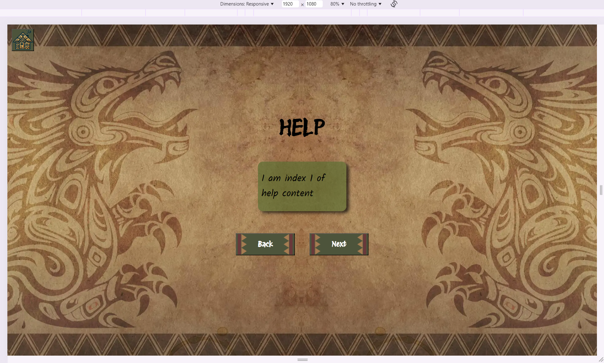
    - 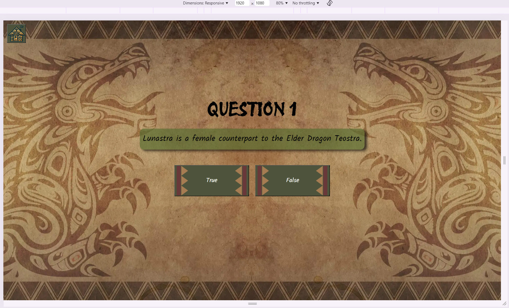
    - 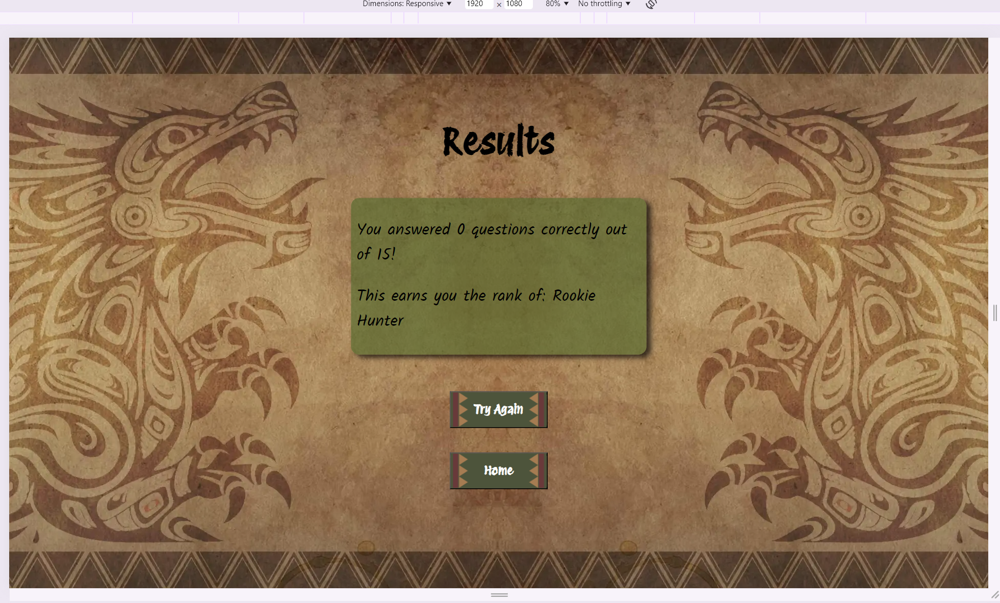
    - 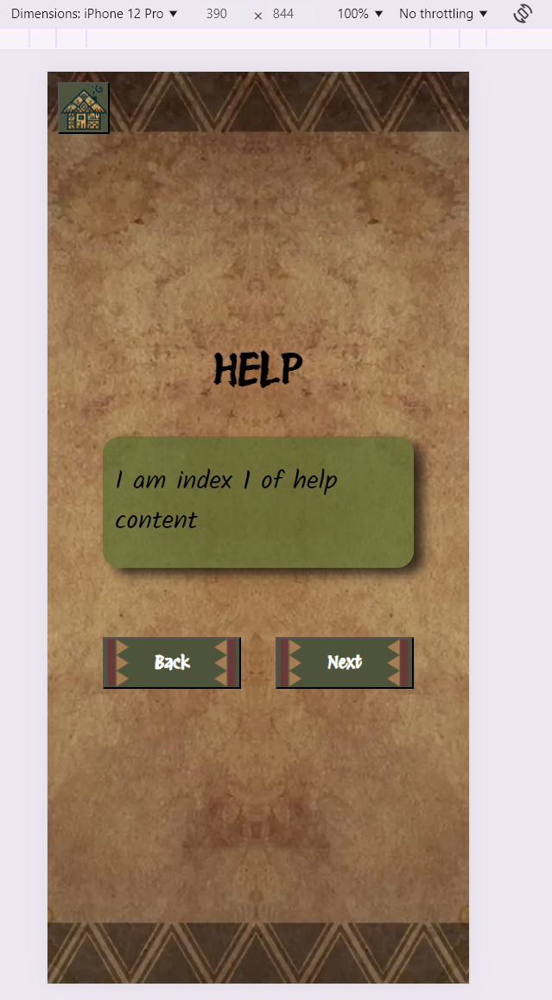
    - 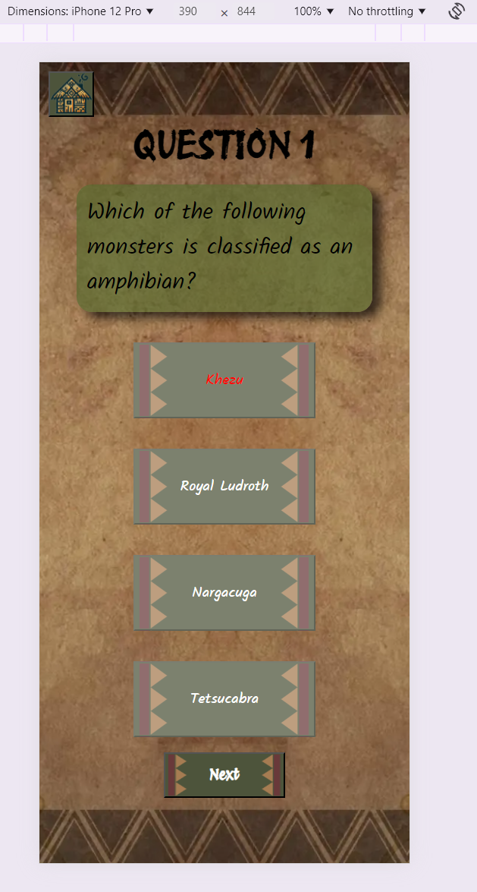
    - 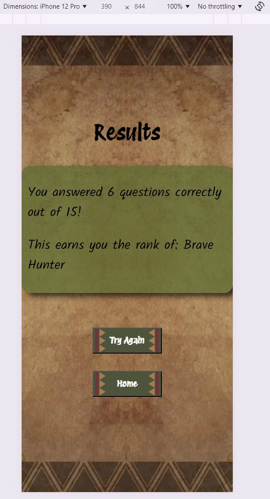
    - 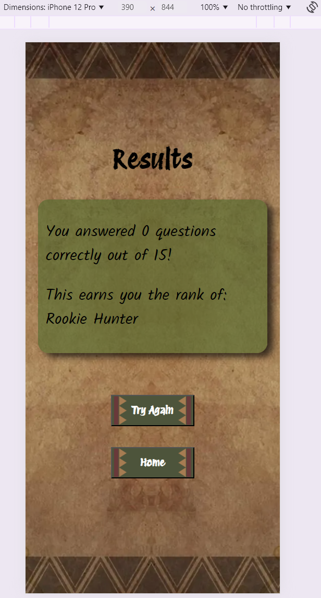

  - Edge:

    - 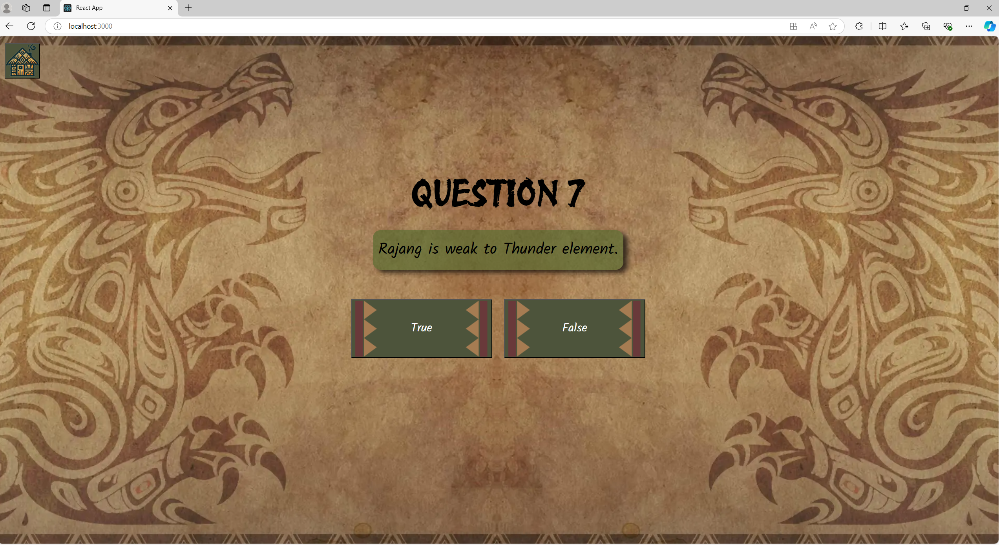
    - 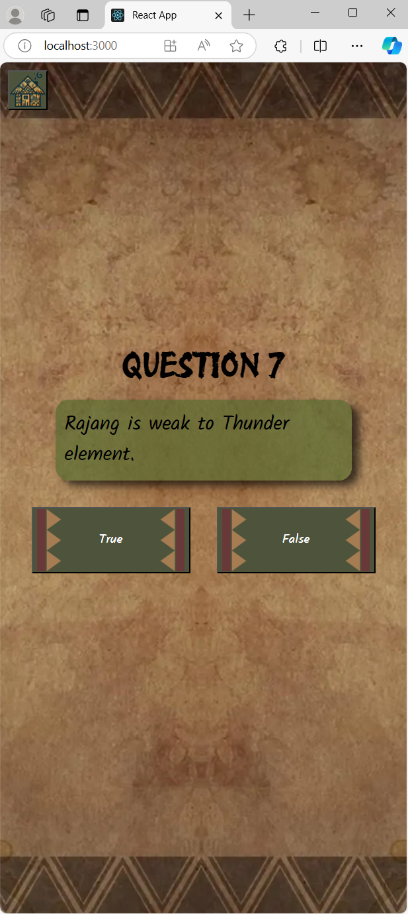

- The webapp's loading times were tested using React Profiler:

  - 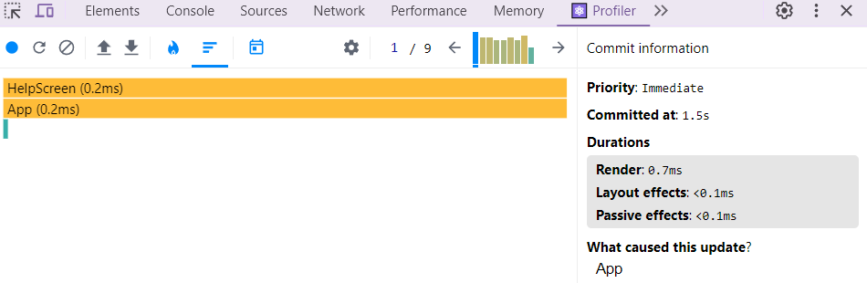
  - 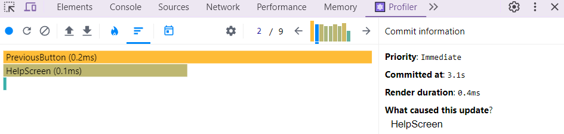

- HTML files were tested using [W3C Validator](https://validator.w3.org/)

  - 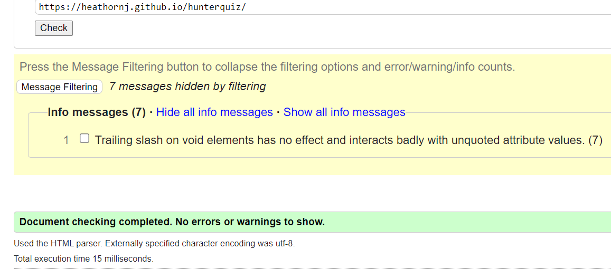

- CSS files were tested using [Jigsaw](https://jigsaw.w3.org/css-validator/):

  - There were no errors.
  - 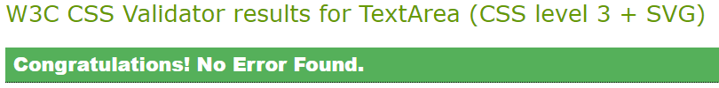

- JS files were tested using [JShint](https://jshint.com/), where possible:

  - No errors were found, just warnings regarding ES versions.
  - 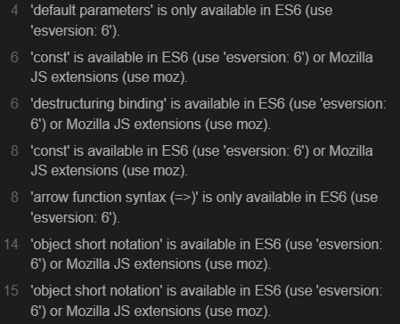

- JSX and formatting have be tested against ESlint recommended config:

  - Errors regarding prop validation were the main highlight outside of formatting files using prettier.
  - 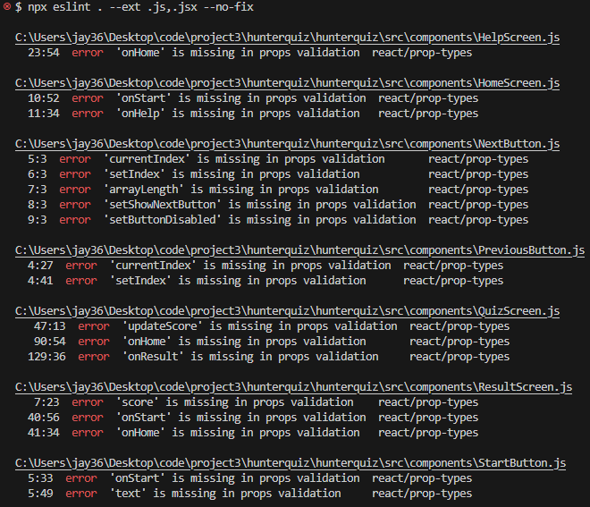
  - These were fixed by importing and using PropTypes to validate the type of props passed to components.
  - 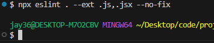

## Deployment

## Deployment to GitHub Pages

- The webapp was deployed to GitHub pages. The steps to deploy are as follows:

  - In the GitHub repository, navigate to the Settings tab.
  - From the source section drop-down menu, select the Main Branch, then click "Save".
  - The page will be automatically refreshed with a detailed ribbon display to indicate the successful deployment.
  - Within project, installed "gh-pages" npm package as a development dependency.
  - Add a "homepage" property with the homepage link in package.json.
  - Add "predeploy" and "deploy" property to the "scripts" object with "npm run build" and "gh-pages -d build" respectively.
  - Push the React app to the repository "npm run deploy -- -m 'commit message'"
  - Configure GitHub Pages Source to "Branch -> gh-pages" and "Folder -> /(root)"

- A detailed explanation of deploying the React App to GitHub Pages can be found [here](https://github.com/gitname/react-gh-pages).

- The live link can be found [here](https://heathornj.github.io/hunterquiz/).

## Contact

Jamie Heathorn
[heathornj@gmail.com](mailto:heathornj@gmail.com)

## Credits

- Inspiration:

  - [starquiz](https://allwrightben.github.io/starquiz/)
  - [Monster Hunter Tri Menu](https://www.nintendo.com/eu/media/images/08_content_images/support_6/nintendo_3ds_20/3ds_monsterhunter3ultimatedatatransfer/3DS_MonsterHunter3Ultimate_DTP_enGB_02_image950w.png)

- Images and iconography creating using [Adobe Photoshop](https://www.adobe.com/uk/products/photoshop.html) and [Bing Image Creator](https://www.bing.com/images/create).

- Information & answers regarding the Monster Hunter series were sourced from [Monster Hunter Wiki](https://monsterhunter.fandom.com/wiki/Monster_Hunter_Wiki).
